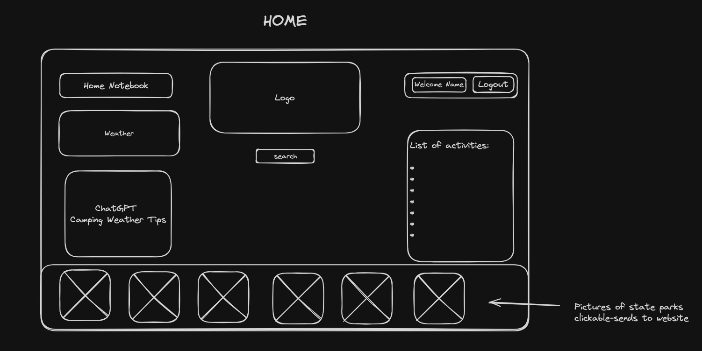
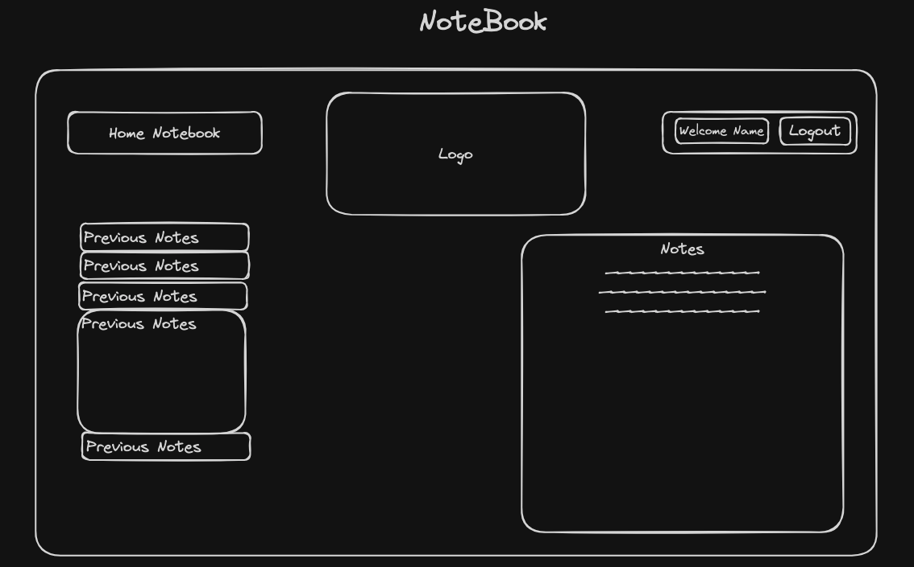
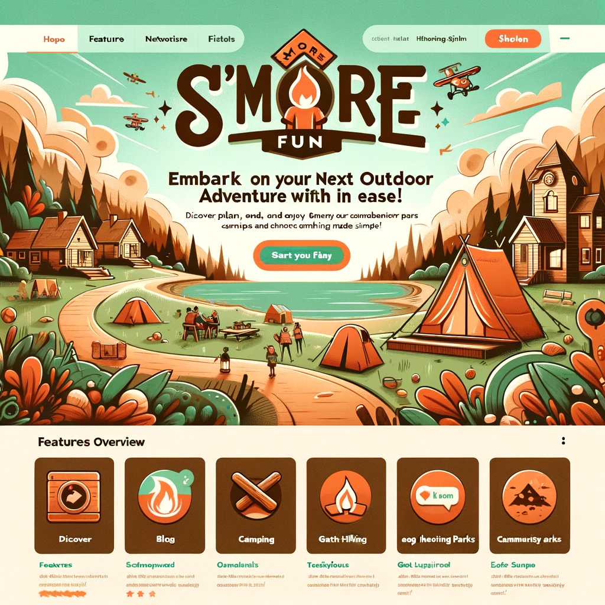

# S'more Fun

Deployed Site: [S'more Fun](https://smore-fun.netlify.app/)

Backend Repoo: [Backend](https://github.com/ArvoyaDev/smore-fun-back-end)

Mobile App Repo: [Mobile App](https://github.com/ArvoyaDev/smore-fun-mobile)

Trello - [Link](https://smore-fun.netlify.app/)

## Summary

S'more Fun is a user-friendly web application designed to simplify outdoor adventure
planning for beginner campers and hikers. By providing essential information, resources,
and community support in one convenient platform, S'more Fun aims to demystify the
camping and hiking experience, making nature more accessible and less daunting for
novices. The app encourages users to explore state parks, trails, and campsites,
offering tools to plan their trips confidently and safely. They can log their experiences
by making a profile, and can read and write their own testimonials.

## What Problem or Pain Point Does It Solve?

Many potential campers and hikers are overwhelmed by the logistics of planning outdoor
activities, from selecting suitable locations to preparing the right gear. S'more
Fun addresses this challenge by offering curated, beginner-friendly information.
It empowers users to discover and enjoy the outdoors, providing a step-by-step approach
to planning and executing camping and hiking trips, thus reducing anxiety and enhancing
their overall experience.

## Minimum Viable Product (MVP) Definition

* User Authentication: Implement OAuth to allow users to create profiles and log
in securely.
* Location-Based Search: Enable users to input a city or state and view nearby state
parks, trails, and campsites, integrating data from the NPS API.
* Weather Integration: Provide current weather information for selected locations
using a weather API, aiding users in their planning but also integrated ChatGPT
API to give tips based off of weather forecast.
* Resource Section: Offer a collection of articles and guides on camping and hiking
basics, tailored for beginners.
* User Reviews and Ratings: Allow users to rate and review campsites and trails
they've visited, contributing to the community knowledge base.

## Wireframe

## Inspiration

Collected from ChatGPT

